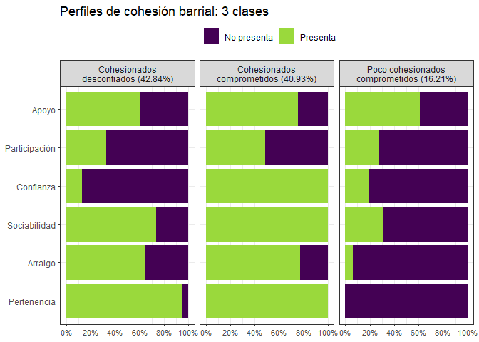
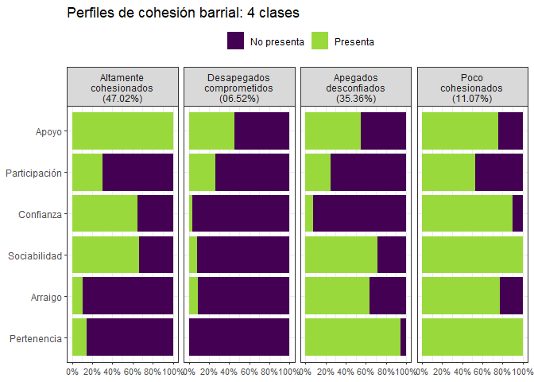
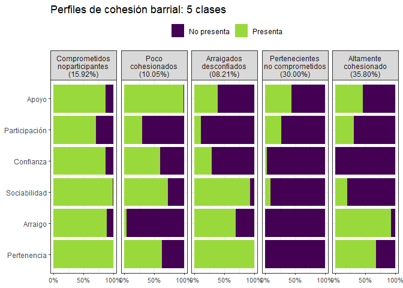

```r
elsoc <- elsoc_long_2016_2021 %>% 
  filter(tipo_atricion == 1, muestra == 1, !is_nsnr(t02_01, t02_02, t02_03, t02_04,
                                                    t03_01, t03_02, t03_03, t03_04,
                                                    t05, t01, c12_01, c07_01)) %>% 
  mutate(spb = (t02_01 + t02_02 + t02_03 + t02_04)/4,
         spbi = cut(spb, breaks = c(0,3,5), labels = c(1,2)),
         soc = (t03_01 + t03_02 + t03_03 + t03_04)/4,
         soci = cut(soc, breaks = c(0,3,5), labels = c(1,2)),
         arra = car::recode(t05, "c(1,2,4)=1; c(3)=2"),
         conf = car::recode(t01, "c(1,2,3)=1; c(4,5)=2"),
         part = car::recode(c12_01, "c(1)=1; c(2,3)=2"),
         apoy = car::recode(c07_01, "c(1)=1; c(2,3)=2")) %>%
  set_labels(spbi, labels = c("No perteneciente", "Perteneciente")) %>% 
  set_labels(soci, labels = c("No sociabilidad", "Sociabilidad")) %>% 
  set_labels(arra, labels = c("Desarraigo","Arraigo")) %>% 
  set_labels(conf, labels = c("No confía","Confía")) %>% 
  set_labels(part, labels = c("No participa","Participa")) %>% 
  set_labels(apoy, labels = c("No apoya","Apoya")) %>% 
  as_numeric(spbi, soci, arra, conf, part, apoy) 

elsoc_wide <- reshape(elsoc, idvar = "idencuesta", timevar = "ola", direction = "wide", sep = "_w0")

elsoc_cl <- elsoc_wide %>% 
  select(idencuesta, estrato_disenno_w05, segmento_disenno_w05, ponderador02_w05,
         spbi_w04, arra_w04, soci_w04, conf_w04,part_w03, apoy_w04) %>% 
  drop_na()
```


```r
set.seed(1)

var <- cbind(spbi_w04, arra_w04, soci_w04, conf_w04, part_w03, apoy_w04) ~ 1

# tres clases
tipos_3 <- poLCA(var, elsoc_cl, nclass = 3, na.rm = TRUE, 
                 maxiter = 5000, nrep = 10)
```

```
## Model 1: llik = -4665.479 ... best llik = -4665.479
## Model 2: llik = -4665.479 ... best llik = -4665.479
## Model 3: llik = -4665.479 ... best llik = -4665.479
## Model 4: llik = -4665.479 ... best llik = -4665.479
## Model 5: llik = -4665.479 ... best llik = -4665.479
## Model 6: llik = -4665.479 ... best llik = -4665.479
## Model 7: llik = -4665.479 ... best llik = -4665.479
## Model 8: llik = -4665.479 ... best llik = -4665.479
## Model 9: llik = -4665.479 ... best llik = -4665.479
## Model 10: llik = -4665.479 ... best llik = -4665.479
## Conditional item response (column) probabilities,
##  by outcome variable, for each class (row) 
##  
## $spbi_w04
##            Pr(1)  Pr(2)
## class 1:  0.0776 0.9224
## class 2:  0.0097 0.9903
## class 3:  1.0000 0.0000
## 
## $arra_w04
##            Pr(1)  Pr(2)
## class 1:  0.3721 0.6279
## class 2:  0.2180 0.7820
## class 3:  0.9379 0.0621
## 
## $soci_w04
##            Pr(1)  Pr(2)
## class 1:  0.2466 0.7534
## class 2:  0.0000 1.0000
## class 3:  0.7286 0.2714
## 
## $conf_w04
##            Pr(1)  Pr(2)
## class 1:  0.6880 0.3120
## class 2:  0.1316 0.8684
## class 3:  0.8240 0.1760
## 
## $part_w03
##            Pr(1)  Pr(2)
## class 1:  0.6975 0.3025
## class 2:  0.4630 0.5370
## class 3:  0.7185 0.2815
## 
## $apoy_w04
##            Pr(1)  Pr(2)
## class 1:  0.3944 0.6056
## class 2:  0.2248 0.7752
## class 3:  0.4026 0.5974
## 
## Estimated class population shares 
##  0.4872 0.3685 0.1442 
##  
## Predicted class memberships (by modal posterior prob.) 
##  0.4285 0.4094 0.1621 
##  
## ========================================================= 
## Fit for 3 latent classes: 
## ========================================================= 
## number of observations: 1363 
## number of estimated parameters: 20 
## residual degrees of freedom: 43 
## maximum log-likelihood: -4665.479 
##  
## AIC(3): 9370.957
## BIC(3): 9475.306
## G^2(3): 70.13939 (Likelihood ratio/deviance statistic) 
## X^2(3): 69.77225 (Chi-square goodness of fit) 
## 
```

```r
elsoc_cl$clase_3 <- as.factor(tipos_3$predclass)
#Observamos las frecuencias de las clases.
tabla_3 <- table(elsoc_cl$clase_3)
tabla_3
```

```
## 
##   1   2   3 
## 584 558 221
```

```r
prop.table(tabla_3)
```

```
## 
##         1         2         3 
## 0.4284666 0.4093910 0.1621423
```

```r
# cuatro clases

tipos_4 <- poLCA(var, elsoc_cl, nclass = 4, na.rm = TRUE, 
                 maxiter = 5000, nrep = 10)
```

```
## Model 1: llik = -4647.342 ... best llik = -4647.342
## Model 2: llik = -4647.342 ... best llik = -4647.342
## Model 3: llik = -4647.342 ... best llik = -4647.342
## Model 4: llik = -4647.342 ... best llik = -4647.342
## Model 5: llik = -4647.342 ... best llik = -4647.342
## Model 6: llik = -4647.342 ... best llik = -4647.342
## Model 7: llik = -4647.342 ... best llik = -4647.342
## Model 8: llik = -4647.342 ... best llik = -4647.342
## Model 9: llik = -4647.342 ... best llik = -4647.342
## Model 10: llik = -4647.342 ... best llik = -4647.342
## Conditional item response (column) probabilities,
##  by outcome variable, for each class (row) 
##  
## $spbi_w04
##            Pr(1)  Pr(2)
## class 1:  0.3958 0.6042
## class 2:  1.0000 0.0000
## class 3:  0.0820 0.9180
## class 4:  0.0000 1.0000
## 
## $arra_w04
##            Pr(1)  Pr(2)
## class 1:  0.8546 0.1454
## class 2:  0.9392 0.0608
## class 3:  0.3151 0.6849
## class 4:  0.1884 0.8116
## 
## $soci_w04
##            Pr(1)  Pr(2)
## class 1:  0.2720 0.7280
## class 2:  0.8640 0.1360
## class 3:  0.2580 0.7420
## class 4:  0.0152 0.9848
## 
## $conf_w04
##            Pr(1)  Pr(2)
## class 1:  0.4835 0.5165
## class 2:  0.9228 0.0772
## class 3:  0.7595 0.2405
## class 4:  0.1729 0.8271
## 
## $part_w03
##            Pr(1)  Pr(2)
## class 1:  0.6810 0.3190
## class 2:  0.7328 0.2672
## class 3:  0.7169 0.2831
## class 4:  0.4726 0.5274
## 
## $apoy_w04
##            Pr(1)  Pr(2)
## class 1:  0.0405 0.9595
## class 2:  0.5155 0.4845
## class 3:  0.4840 0.5160
## class 4:  0.2415 0.7585
## 
## Estimated class population shares 
##  0.1239 0.1071 0.3595 0.4095 
##  
## Predicted class memberships (by modal posterior prob.) 
##  0.0653 0.1108 0.3536 0.4703 
##  
## ========================================================= 
## Fit for 4 latent classes: 
## ========================================================= 
## number of observations: 1363 
## number of estimated parameters: 27 
## residual degrees of freedom: 36 
## maximum log-likelihood: -4647.342 
##  
## AIC(4): 9348.684
## BIC(4): 9489.555
## G^2(4): 33.86563 (Likelihood ratio/deviance statistic) 
## X^2(4): 30.84492 (Chi-square goodness of fit) 
## 
```

```r
elsoc_cl$clase_4 <- as.factor(tipos_4$predclass)
#Observamos las frecuencias de las clases.
tabla_4 <- table(elsoc_cl$clase_4)
tabla_4
```

```
## 
##   1   2   3   4 
##  89 151 482 641
```

```r
prop.table(tabla_4)
```

```
## 
##          1          2          3          4 
## 0.06529714 0.11078503 0.35363169 0.47028613
```

```r
# cinco clases

tipos_5 <- poLCA(var, elsoc_cl, nclass = 5, na.rm = TRUE, 
                 maxiter = 5000, nrep = 10)
```

```
## Model 1: llik = -4644.199 ... best llik = -4644.199
## Model 2: llik = -4643.842 ... best llik = -4643.842
## Model 3: llik = -4644.522 ... best llik = -4643.842
## Model 4: llik = -4643.842 ... best llik = -4643.842
## Model 5: llik = -4643.842 ... best llik = -4643.842
## Model 6: llik = -4643.842 ... best llik = -4643.842
## Model 7: llik = -4644.061 ... best llik = -4643.842
## Model 8: llik = -4644.456 ... best llik = -4643.842
## Model 9: llik = -4643.842 ... best llik = -4643.842
## Model 10: llik = -4644.061 ... best llik = -4643.842
## Conditional item response (column) probabilities,
##  by outcome variable, for each class (row) 
##  
## $spbi_w04
##            Pr(1)  Pr(2)
## class 1:  0.0000 1.0000
## class 2:  0.3850 0.6150
## class 3:  0.0133 0.9867
## class 4:  1.0000 0.0000
## class 5:  0.2309 0.7691
## 
## $arra_w04
##            Pr(1)  Pr(2)
## class 1:  0.1626 0.8374
## class 2:  0.8016 0.1984
## class 3:  0.3233 0.6767
## class 4:  1.0000 0.0000
## class 5:  0.2563 0.7437
## 
## $soci_w04
##            Pr(1)  Pr(2)
## class 1:  0.0179 0.9821
## class 2:  0.2770 0.7230
## class 3:  0.1431 0.8569
## class 4:  0.8724 0.1276
## class 5:  0.4453 0.5547
## 
## $conf_w04
##            Pr(1)  Pr(2)
## class 1:  0.2002 0.7998
## class 2:  0.5090 0.4910
## class 3:  0.5287 0.4713
## class 4:  0.9140 0.0860
## class 5:  1.0000 0.0000
## 
## $part_w03
##            Pr(1)  Pr(2)
## class 1:  0.3958 0.6042
## class 2:  0.6640 0.3360
## class 3:  0.7934 0.2066
## class 4:  0.7316 0.2684
## class 5:  0.6673 0.3327
## 
## $apoy_w04
##            Pr(1)  Pr(2)
## class 1:  0.2142 0.7858
## class 2:  0.0706 0.9294
## class 3:  0.4610 0.5390
## class 4:  0.5136 0.4864
## class 5:  0.5653 0.4347
## 
## Estimated class population shares 
##  0.3504 0.15 0.2867 0.0974 0.1154 
##  
## Predicted class memberships (by modal posterior prob.) 
##  0.358 0.1592 0.3001 0.1005 0.0822 
##  
## ========================================================= 
## Fit for 5 latent classes: 
## ========================================================= 
## number of observations: 1363 
## number of estimated parameters: 34 
## residual degrees of freedom: 29 
## maximum log-likelihood: -4643.842 
##  
## AIC(5): 9355.683
## BIC(5): 9533.076
## G^2(5): 26.86515 (Likelihood ratio/deviance statistic) 
## X^2(5): 24.84918 (Chi-square goodness of fit) 
## 
```

```r
elsoc_cl$clase_5 <- as.factor(tipos_5$predclass)
#Observamos las frecuencias de las clases.
tabla_5 <- table(elsoc_cl$clase_5)
tabla_5
```

```
## 
##   1   2   3   4   5 
## 488 217 409 137 112
```

```r
prop.table(tabla_5)
```

```
## 
##          1          2          3          4          5 
## 0.35803375 0.15920763 0.30007337 0.10051357 0.08217168
```


```r
tab1_3 <- elsoc_cl %>% group_by(clase_3, spbi_w04) %>%
  summarise (n = n()) %>% mutate(freq = n / sum(n)) %>% 
  mutate(var = 1) %>% rename(Clase=clase_3, Tipos=spbi_w04)

tab2_3 <- elsoc_cl %>% group_by(clase_3, arra_w04) %>%
  summarise (n = n()) %>% mutate(freq = n / sum(n)) %>% 
  mutate(var = 2) %>% rename(Clase=clase_3, Tipos=arra_w04)

tab3_3 <- elsoc_cl %>% group_by(clase_3, soci_w04) %>%
  summarise (n = n()) %>% mutate(freq = n / sum(n)) %>% 
  mutate(var = 3) %>% rename(Clase=clase_3, Tipos=soci_w04)

tab4_3 <- elsoc_cl %>% group_by(clase_3, conf_w04) %>%
  summarise (n = n()) %>% mutate(freq = n / sum(n)) %>% 
  mutate(var = 4) %>% rename(Clase=clase_3, Tipos=conf_w04)

tab5_3 <- elsoc_cl %>% group_by(clase_3, part_w03) %>%
  summarise (n = n()) %>% mutate(freq = n / sum(n)) %>% 
  mutate(var = 5) %>% rename(Clase=clase_3, Tipos=part_w03)

tab6_3 <- elsoc_cl %>% group_by(clase_3, apoy_w04) %>%
  summarise (n = n()) %>% mutate(freq = n / sum(n)) %>% 
  mutate(var = 6) %>% rename(Clase=clase_3, Tipos=apoy_w04)

tab_3 <- rbind(tab1_3, tab2_3, tab3_3, tab4_3, tab5_3, tab6_3)
rm(tab1_3, tab2_3, tab3_3, tab4_3, tab5_3, tab6_3)

tab_3 <- tab_3 %>% 
  mutate(Clase = factor(Clase, levels = c(1,2,3), labels = c("Cohesionados\ndesconfiados (42.84%)", 
                                                             "Cohesionados\ncomprometidos (40.93%)", 
                                                             "Poco cohesionados\ncomprometidos (16.21%)")),
         Tipos  = factor(Tipos, levels = c(1,2), labels = c("No presenta", "Presenta")),
         var  = factor(var, levels = c(1,2,3,4,5,6), labels = c("Pertenencia",
                                                                "Arraigo",
                                                                "Sociabilidad",
                                                                "Confianza",
                                                                "Participación",
                                                                "Apoyo")))


tab_3 %>% ggplot(aes(x = freq, y = var, fill = Tipos)) + 
  geom_bar(stat = 'identity', position = 'stack') +
  labs(y = NULL, x = NULL,
       title = "Perfiles de cohesión barrial: 3 clases", fill = "") +
  scale_x_continuous(breaks = scales::pretty_breaks(n = 5), labels = scales::percent, limits=c(0, 1)) +
  theme_bw() + 
  scale_fill_viridis_d(end = .85, option = 'viridis') +
  theme(axis.text.x = element_text(size = rel(.9)),
        legend.position = 'top',
        legend.title = element_blank()) +
  facet_grid(~ Clase) 
```



```r
#ggsave(filename = "3_clases.jpg", width = 35, height = 15, units = "cm")
```


```r
tab1_4 <- elsoc_cl %>% group_by(clase_4, spbi_w04) %>%
  summarise (n = n()) %>% mutate(freq = n / sum(n)) %>% 
  mutate(var = 1) %>% rename(Clase=clase_4, Tipos=spbi_w04)

tab2_4 <- elsoc_cl %>% group_by(clase_4, arra_w04) %>%
  summarise (n = n()) %>% mutate(freq = n / sum(n)) %>% 
  mutate(var = 2) %>% rename(Clase=clase_4, Tipos=arra_w04)

tab3_4 <- elsoc_cl %>% group_by(clase_4, soci_w04) %>%
  summarise (n = n()) %>% mutate(freq = n / sum(n)) %>% 
  mutate(var = 3) %>% rename(Clase=clase_4, Tipos=soci_w04)

tab4_4 <- elsoc_cl %>% group_by(clase_4, conf_w04) %>%
  summarise (n = n()) %>% mutate(freq = n / sum(n)) %>% 
  mutate(var = 4) %>% rename(Clase=clase_4, Tipos=conf_w04)

tab5_4 <- elsoc_cl %>% group_by(clase_4, part_w03) %>%
  summarise (n = n()) %>% mutate(freq = n / sum(n)) %>% 
  mutate(var = 5) %>% rename(Clase=clase_4, Tipos=part_w03)

tab6_4 <- elsoc_cl %>% group_by(clase_4, apoy_w04) %>%
  summarise (n = n()) %>% mutate(freq = n / sum(n)) %>% 
  mutate(var = 6) %>% rename(Clase=clase_4, Tipos=apoy_w04)

tab_4 <- rbind(tab1_4, tab2_4, tab3_4, tab4_4, tab5_4, tab6_4)
rm(tab1_4, tab2_4, tab3_4, tab4_4, tab5_4, tab6_4)

tab_4 <- tab_4 %>% 
  mutate(Clase = factor(Clase, levels = c(1,2,3,4), labels = c("Altamente\ncohesionados\n(47.02%)", 
                                                             "Desapegados\ncomprometidos\n(06.52%)", 
                                                             "Apegados\ndesconfiados\n(35.36%)",
                                                             "Poco\ncohesionados\n(11.07%)")),
         Tipos  = factor(Tipos, levels = c(1,2), labels = c("No presenta", "Presenta")),
         var  = factor(var, levels = c(1,2,3,4,5,6), labels = c("Pertenencia",
                                                                "Arraigo",
                                                                "Sociabilidad",
                                                                "Confianza",
                                                                "Participación",
                                                                "Apoyo")))


tab_4 %>% ggplot(aes(x = freq, y = var, fill = Tipos)) + 
  geom_bar(stat = 'identity', position = 'stack') +
  labs(y = NULL, x = NULL,
       title = "Perfiles de cohesión barrial: 4 clases", fill = "") +
  scale_x_continuous(breaks = scales::pretty_breaks(n = 5), labels = scales::percent, limits=c(0, 1)) +
  theme_bw() + 
  scale_fill_viridis_d(end = .85, option = 'viridis') +
  theme(axis.text.x = element_text(size = rel(.9)),
        legend.position = 'top',
        legend.title = element_blank()) +
  facet_grid(~ Clase) 
```



```r
#ggsave(filename = "4_clases.jpg", width = 35, height = 15, units = "cm")
```


```r
tab1_5 <- elsoc_cl %>% group_by(clase_5, spbi_w04) %>%
  summarise (n = n()) %>% mutate(freq = n / sum(n)) %>% 
  mutate(var = 1) %>% rename(Clase=clase_5, Tipos=spbi_w04)

tab2_5 <- elsoc_cl %>% group_by(clase_5, arra_w04) %>%
  summarise (n = n()) %>% mutate(freq = n / sum(n)) %>% 
  mutate(var = 2) %>% rename(Clase=clase_5, Tipos=arra_w04)

tab3_5 <- elsoc_cl %>% group_by(clase_5, soci_w04) %>%
  summarise (n = n()) %>% mutate(freq = n / sum(n)) %>% 
  mutate(var = 3) %>% rename(Clase=clase_5, Tipos=soci_w04)

tab4_5 <- elsoc_cl %>% group_by(clase_5, conf_w04) %>%
  summarise (n = n()) %>% mutate(freq = n / sum(n)) %>% 
  mutate(var = 4) %>% rename(Clase=clase_5, Tipos=conf_w04)

tab5_5 <- elsoc_cl %>% group_by(clase_5, part_w03) %>%
  summarise (n = n()) %>% mutate(freq = n / sum(n)) %>% 
  mutate(var = 5) %>% rename(Clase=clase_5, Tipos=part_w03)

tab6_5 <- elsoc_cl %>% group_by(clase_5, apoy_w04) %>%
  summarise (n = n()) %>% mutate(freq = n / sum(n)) %>% 
  mutate(var = 6) %>% rename(Clase=clase_5, Tipos=apoy_w04)

tab_5 <- rbind(tab1_5, tab2_5, tab3_5, tab4_5, tab5_5, tab6_5)
rm(tab1_5, tab2_5, tab3_5, tab4_5, tab5_5, tab6_5)

tab_5 <- tab_5 %>% 
  mutate(Clase = factor(Clase, levels = c(1,2,3,4,5), labels = c("Comprometidos\nnoparticipantes\n(15.92%)", 
                                                                 "Poco\ncohesionados\n(10.05%)",
                                                                 "Arraigados\ndesconfiados\n(08.21%)",
                                                                 "Pertenecientes\nno comprometidos\n(30.00%)",
                                                                 "Altamente\ncohesionado\n(35.80%)")),
         Tipos  = factor(Tipos, levels = c(1,2), labels = c("No presenta", "Presenta")),
         var  = factor(var, levels = c(1,2,3,4,5,6), labels = c("Pertenencia",
                                                                "Arraigo",
                                                                "Sociabilidad",
                                                                "Confianza",
                                                                "Participación",
                                                                "Apoyo")))


tab_5 %>% ggplot(aes(x = freq, y = var, fill = Tipos)) + 
  geom_bar(stat = 'identity', position = 'stack') +
  labs(y = NULL, x = NULL,
       title = "Perfiles de cohesión barrial: 5 clases", fill = "") +
  scale_x_continuous(breaks = scales::pretty_breaks(n = 3), labels = scales::percent, limits=c(0, 1)) +
  theme_bw() + 
  scale_fill_viridis_d(end = .85, option = 'viridis') +
  theme(axis.text.x = element_text(size = rel(.9)),
        legend.position = 'top',
        legend.title = element_blank()) +
  facet_grid(~ Clase) 
```



```r
#ggsave(filename = "5_clases.jpg", width = 35, height = 15, units = "cm")
```

