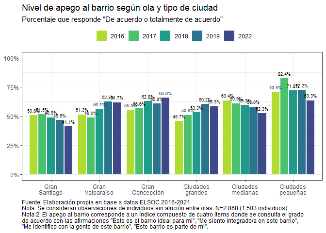
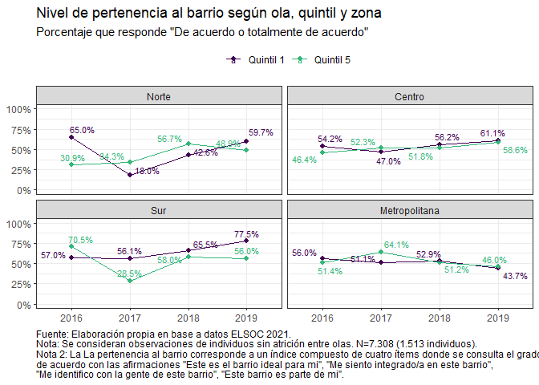
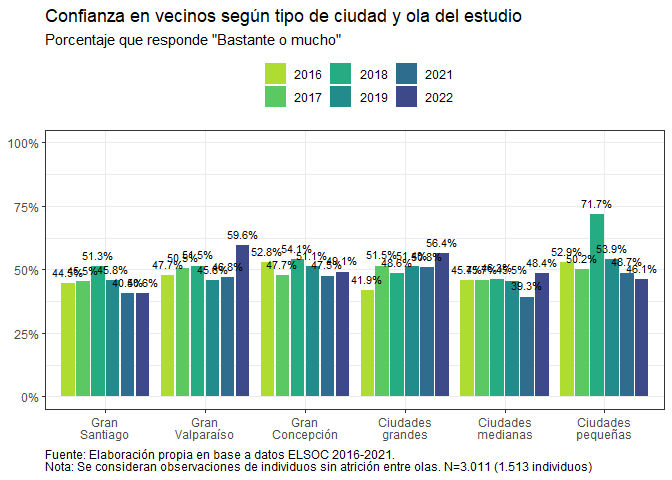
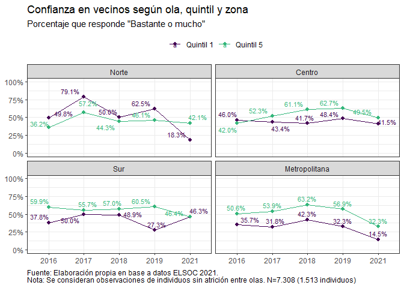
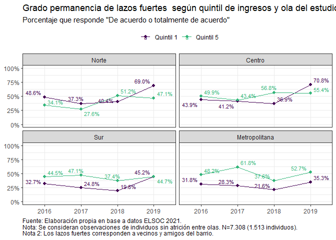

# 1. Apego al barrio

## 1.1. Sentido de pertenencia al barrio

## 1.2. Arraigo al barrio

# 2. Relaciones vecinales

## 2.1. Sociabilidad barrial

## 2.2. Confianza en vecinos

## 2.3. Lazos fuertes

# 3. Compromiso cívico local

## 3.1. Participación junta de vecinos

## 3.2. Apoyo social

